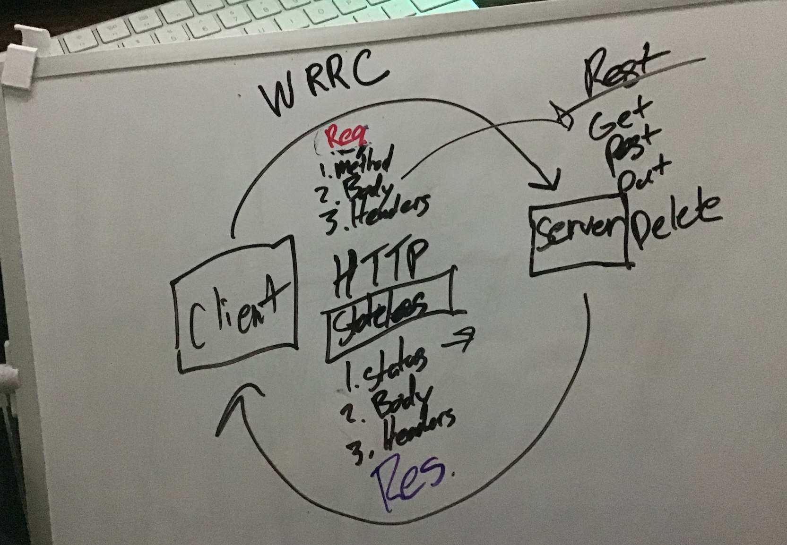

# Basic API Server

## Author: Elijah Prom Version: 1.0.0

## Overview

A basic API server that runs tests to see if the server works
the ability to add a record, get all records, get one record, update a record, and delete a record

## Getting Started

├── .gitignore
├── .eslintrc.json
├── **tests**
│ ├── server.test.js
│ ├── logger.test.js
├── src
│ ├── error-handlers
│ │ ├── 404.js
│ │ ├── 500.js
│ ├── middleware
│ │ ├── logger.js
│ │ ├── validator.js
│ ├── models
│ │ ├── food.js
│ │ ├── clothes.js
│ ├── routes
│ │ ├── food.js
│ │ ├── clothes.js
│ ├── server.js
├── index.js
└── package.json

The user needs to do the following to get the code up and running: -Clone the repository from github here -Run npm install in the lab-steve directory to install all the Node packages -Run nodemon to start the server listening -Utilize something like Postman or HTTPie to make GET, PUT, POST, and DELETE requests -Make certain they match the format described above

## Architecture

-NodeJS -npm -JS

## Credits and Collaborations

NodeJS npm JavaScript

[Heroku](https://git.heroku.com/elijah-basic-api-server.git)

